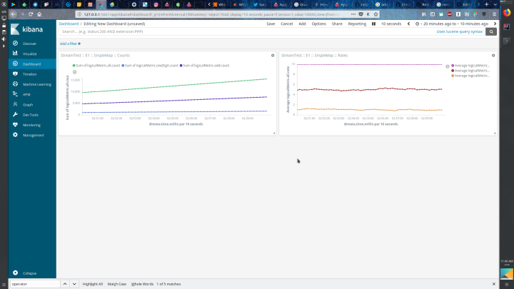

#### For Flink @ flink-conf.yaml

```

metrics.reporters: debug, jm, tm, jobstat, jobtask, joboperator 

# Debugger

metrics.reporter.debug.class: com.sameei.xtool.elasticreporter.v1.flink.Debugger
metrics.reporter.debug.elastic-url: http://localhost:9200
metrics.reporter.debug.source-id: single-node
metrics.reporter.debug.index-pattern: stage-flink-c1-mterics-debug-<year>-<month>
metrics.reporter.debug.id-pattern: <source_id>-<millis>
metrics.reporter.debug.datetime-pattern: yyyy-MM-dd HH:mm:ss
metrics.reporter.debug.zone: UTC

# Job Manager

metrics.reporter.jm.class: com.sameei.xtool.elasticreporter.v1.flink.Reporter
metrics.reporter.jm.elastic-url: http://localhost:9200
metrics.reporter.jm.source-id: single-node
metrics.reporter.jm.index-pattern: stage-flink-c1-jobmanager-<year>-<month>-<day_of_month>
metrics.reporter.jm.id-pattern: <host>-<millis>
metrics.reporter.jm.datetime-pattern: yyyy-MM-dd HH:mm:ss
metrics.reporter.jm.zone: UTC
metrics.reporter.jm.filter-by.scope: <host>.jobmanager
metrics.reporter.tm.filter-by.reject-vars: <job_name>
metrics.reporter.jm.group-by: <host>
metrics.reporter.jm.name-by.scope-drop-left: 2

# Task Manager

metrics.reporter.tm.class: com.sameei.xtool.elasticreporter.v1.flink.Reporter
metrics.reporter.tm.elastic-url: http://localhost:9200
metrics.reporter.tm.source-id: single-node
metrics.reporter.tm.index-pattern: stage-flink-c1-taskmanager-<year>-<month>-<day_of_month>
metrics.reporter.tm.id-pattern: <host>-<millis>
metrics.reporter.tm.datetime-pattern: yyyy-MM-dd HH:mm:ss
metrics.reporter.tm.zone: UTC
metrics.reporter.tm.filter-by.scope: <host>.taskmanager.<tm_id>
metrics.reporter.tm.filter-by.reject-vars: <job_name>
metrics.reporter.tm.group-by: <tm_id>
metrics.reporter.tm.name-by.scope-drop-left: 3

# Job Stat
metrics.reporter.jobstat.class: com.sameei.xtool.elasticreporter.v1.flink.Reporter
metrics.reporter.jobstat.elastic-url: http://localhost:9200
metrics.reporter.jobstat.source-id: single-node
metrics.reporter.jobstat.index-pattern: stage-flink-c1-jobstat-<job_name>-at-<year>-<month>-<day_of_month>
metrics.reporter.jobstat.id-pattern: <task_id>-<subtask_index>-<source_id>-<millis>
metrics.reporter.jobstat.datetime-pattern: yyyy-MM-dd HH:mm:ss
metrics.reporter.jobstat.zone: UTC
metrics.reporter.jobstat.filter-by.scope: <host>.jobmanager.<job_name>
metrics.reporter.jobstat.filter-by.reject-vars: <tm_id>.<operator_id>
metrics.reporter.jobstat.group-by: <job_name>
metrics.reporter.jobstat.name-by.scope-drop-left: 3

# Task Metrics Per Job

metrics.reporter.jobtask.class: com.sameei.xtool.elasticreporter.v1.flink.Reporter
metrics.reporter.jobtask.elastic-url: http://localhost:9200
metrics.reporter.jobtask.source-id: single-node
metrics.reporter.jobtask.index-pattern: stage-flink-c1-task-<job_name>-at-<year>-<month>-<day_of_month>
metrics.reporter.jobtask.id-pattern: <task_id>-<subtask_index>-<source_id>-<millis>
metrics.reporter.jobtask.datetime-pattern: yyyy-MM-dd HH:mm:ss
metrics.reporter.jobtask.zone: UTC
metrics.reporter.jobtask.filter-by.scope: <host>.taskmanager.<tm_id>.<job_name>.<task_name>.<subtask_index>
metrics.reporter.jobtask.group-by: <job_name>-<task_id>-<subtask_index>
metrics.reporter.jobtask.name-by.scope-drop-left: 6

# Operator Metrics Per Job

metrics.reporter.joboperator.class: com.sameei.xtool.elasticreporter.v1.flink.Reporter
metrics.reporter.joboperator.elastic-url: http://localhost:9200
metrics.reporter.joboperator.source-id: single-node
metrics.reporter.joboperator.index-pattern: stage-flink-c1-operator-<job_name>-<operator_name>-<year>-<month>-<day_of_month>
metrics.reporter.joboperator.id-pattern: <operator_id>-<subtask_index>-<source_id>-<millis>
metrics.reporter.joboperator.datetime-pattern: yyyy-MM-dd HH:mm:ss
metrics.reporter.joboperator.zone: UTC
metrics.reporter.joboperator.filter-by.scope: <host>.taskmanager.<tm_id>.<job_name>.<operator_name>.<subtask_index>
metrics.reporter.joboperator.group-by: <job_name>-<operator_id>-<subtask_index>
metrics.reporter.joboperator.name-by.scope-drop-left: 6

```

### For Kamon @ application.conf

```
custom-path = {
  name = "kamon.elastic-reporter"
  source-id = "SimpleAkkaApp"
  elastic-url = "http://localhost:9200"
  index-pattern = "<source_id>-<year>-<month>-<day_of_month>"
  id-pattern = "<source_id>-<millis>"
  datetime-pattern = "yyyy-MM-dd HH:mm:ss"
  datetime-zone = "UTC"
}
```


